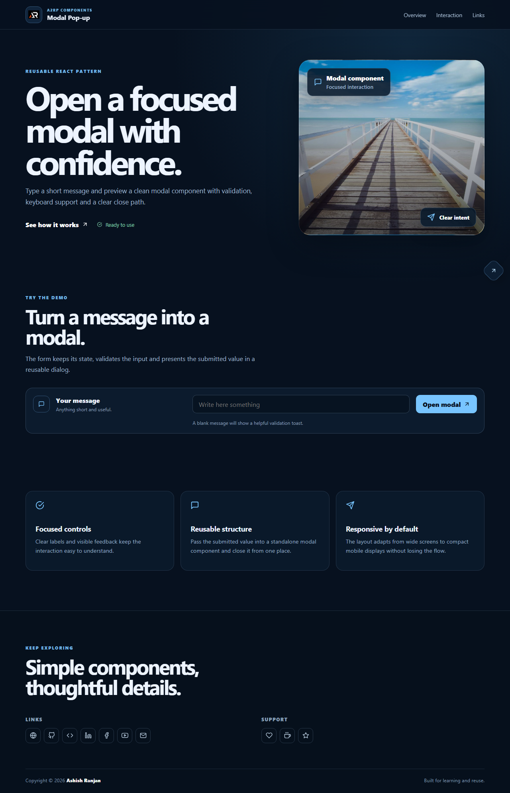

# Modal Pop-up

A responsive React modal form component that validates user input and displays the submitted value in an accessible, reusable dialog.

## Features

- Responsive fixed header with local logo and mobile navigation
- Form validation with toast feedback
- Modal open, close, outside-click and Escape-key interactions
- Local visual asset, responsive layout and icon-only footer links
- Floating go-top control and dynamic copyright year

## Tech stack

- React and Create React App
- SCSS modules
- React Icons
- React Toastify

## Run locally

```bash
npm install
npm start
```

## Deploy

```bash
npm run deploy
```

## Screenshot



## Links

- Live: [https://a2rp.github.io/modal-pop-up/](https://a2rp.github.io/modal-pop-up/)
- Repository: [https://github.com/a2rp/modal-pop-up](https://github.com/a2rp/modal-pop-up)
- Portfolio: [https://www.ashishranjan.net/](https://www.ashishranjan.net/)
- GitHub: [https://github.com/a2rp](https://github.com/a2rp)
- CodePen: [https://codepen.io/ash1198](https://codepen.io/ash1198)
- LinkedIn: [https://www.linkedin.com/in/aashishranjan](https://www.linkedin.com/in/aashishranjan)
- Facebook: [https://www.facebook.com/theash.ashish/](https://www.facebook.com/theash.ashish/)
- YouTube: [https://www.youtube.com/@ashishranjan-ashz?sub_confirmation=1](https://www.youtube.com/@ashishranjan-ashz?sub_confirmation=1)
- Email: [ash.ranjan09@gmail.com](mailto:ash.ranjan09@gmail.com)

## Support

- Support: [https://a2rp-donation-page.netlify.app/](https://a2rp-donation-page.netlify.app/)
- Buy Me a Coffee: [https://buymeacoffee.com/a2rp](https://buymeacoffee.com/a2rp)
- Patreon: [https://patreon.com/a2rp](https://patreon.com/a2rp)